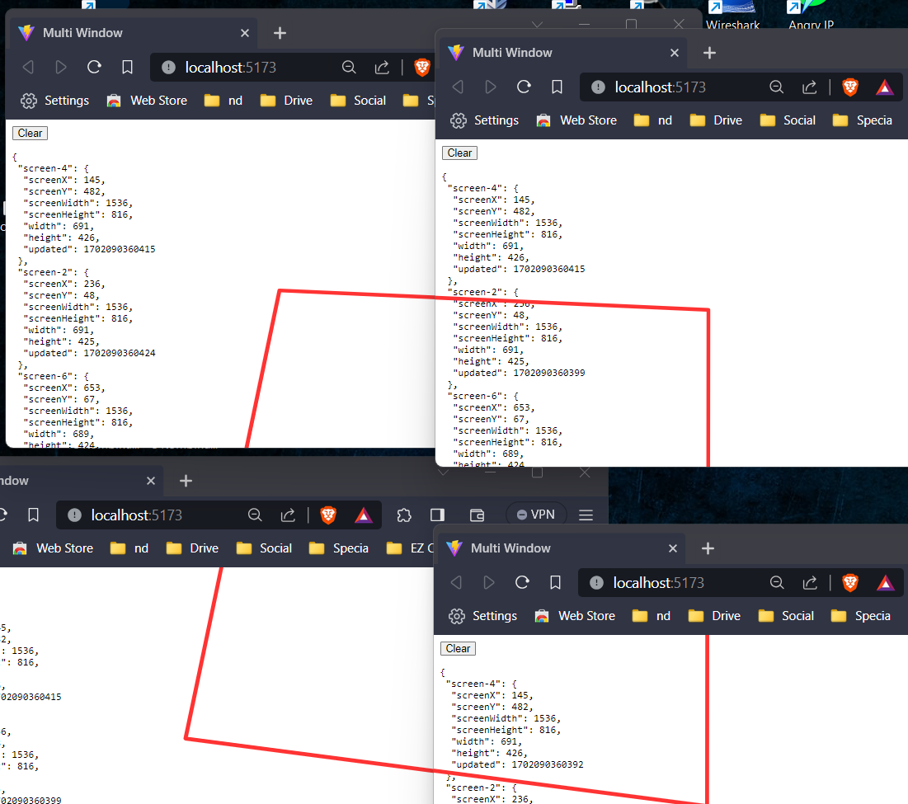

# Multi Window Synchron

Utilizes the browser's localStorage to store and track information about browser windows/screens

# How Does This Work

For each window/screen, a unique identifier is created, and details such as **screenX**, **screenY**, **screenWidth**, **screenHeight**, **width**, **height** are stored in the localStorage. These details are updated every 0.01 seconds, allowing for real-time tracking of the window/screen state.

Base on that application visually represents the arrangement of screens by drawing an SVG path connecting the centers of screens.

